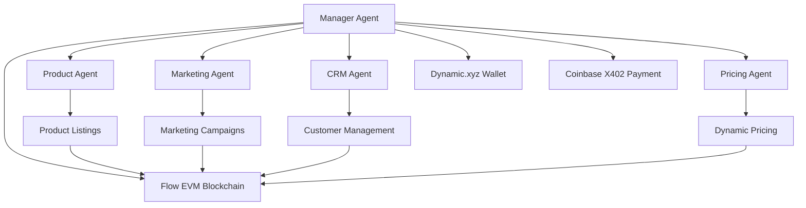

# DaVinci: AI-Powered Multi-Agent E-commerce Ecosystem

🏆 **ETH Global NYC 2025** - Competing for "Best Use of Actions & Agents on Flow" and "Best App Involving AI Built on Dynamic" and " Build a Great Onchain App Using CDP"

**Built on Flow EVM Testnet** - Transparent AI Agent Behavior Tracking

## 🌟 Project Overview

DaVinci is a revolutionary AI-powered multi-agent e-commerce ecosystem that empowers anyone to build a global, automated, and continuously evolving online business. Built with Dynamic.xyz for seamless wallet management and user onboarding, featuring a manager agent that orchestrates all operations and autonomously purchases LLM API credits from OpenRouter via Coinbase X402, while tracking all agent decisions and product listings with unique SKUs transparently on Flow EVM blockchain for complete audit trails.

**Our Vision**: Enable agents to evolve autonomously by analyzing wallet signals and business performance data, utilizing digital clone technology to simulate and optimize marketing strategies based on real customer behavior patterns. Run your store 24/7 with full automation and generate profits effortlessly.

---

## 🏆 ETH Global NYC 2025 Submission

### Flow Prize Category: Best Use of Actions & Agents on Flow

**Contract Address**: [`0xd2F523a0085781Aa8492eeA6E84F0152B2c26E8f`](https://evm-testnet.flowscan.io/address/0xd2F523a0085781Aa8492eeA6E84F0152B2c26E8f) (Flow EVM Testnet)

**Requirements Met**:
- ✅ **Deployed Smart Contract**: Custom listing sync contract on Flow EVM Testnet
- ✅ **Agent Actions**: AI agents autonomously create product listings and sync to blockchain
- ✅ **Transparent Behavior**: Every agent decision recorded on-chain for verification
- ✅ **Real-world Application**: Solves trust issues in AI-powered e-commerce at scale

**Live Demo**: Successfully created "Cherry keyboard" listing with SKU `FM-ELE-3m3dm-001`


### Dynamic Prize Category: Best App Involving AI Built on Dynamic

**Environment ID**: `0b7822a0-f446-4987-87f9-83b179f422e1`

**Requirements Met**:
- ✅ **Dynamic SDK Integration**: Embedded wallet authentication with multi-chain support
- ✅ **AI + Crypto Experience**: Wallet-gated AI agent conversations with personalization
- ✅ **Seamless UX**: Progressive Web3 onboarding with visitor mode (5 free messages)
- ✅ **Non-crypto User Friendly**: Email/social login with hidden wallet complexity

---

## 🏗️ System Architecture

### Hierarchical Multi-Agent Framework

DaVinci implements a sophisticated hierarchical multi-agent architecture where a central Manager Agent orchestrates specialized e-commerce agents, each with autonomous decision-making capabilities while maintaining complete transparency through blockchain integration.



### Agent Hierarchy & Responsibilities

#### **Manager Agent (Orchestrator)**
- **Role**: Central coordinator and financial controller
- **Capabilities**:
  - Orchestrates all specialized agents
  - Autonomous LLM credit purchasing via Coinbase X402
  - Resource allocation and budget management
  - Performance monitoring and optimization
  - Self-evolution through business data analysis
- **Technology**: OpenRouter API integration with X402 payment gateway

#### **Product Agent**
- **Role**: Product lifecycle management
- **Capabilities**:
  - AI-powered product sourcing and curation
  - Automated listing creation with unique SKU generation
  - Inventory tracking and stock optimization
  - Supplier relationship management
- **Flow Integration**: Product listings synced to blockchain with SKU `FM-CAT-EID123-001`

#### **Marketing Agent**
- **Role**: Customer acquisition and engagement
- **Capabilities**:
  - Digital clone technology for customer simulation
  - Automated content generation across channels
  - User segmentation and targeting
  - Campaign performance optimization
- **Innovation**: Creates digital customer personas for A/B testing strategies

#### **CRM Agent**
- **Role**: Customer relationship management
- **Capabilities**:
  - Wallet-based customer profiling
  - Behavioral pattern analysis
  - Personalized communication automation
  - Customer lifecycle optimization
- **Dynamic Integration**: Leverages wallet history for personalization

#### **Pricing Agent**
- **Role**: Dynamic pricing optimization
- **Capabilities**:
  - Real-time market analysis
  - Competitor pricing monitoring
  - Demand-based price adjustment
  - Profit margin optimization
- **Data Sources**: Flow blockchain + external market APIs

---

## 🌊 Flow EVM Integration

### AI Agent Actions on Flow
- **Product Listings**: Every AI-generated product listing recorded on-chain with unique SKUs
- **Inventory Tracking**: Real-time stock updates and availability synchronized to Flow EVM
- **Decision Audit Trail**: Complete history of AI agent decisions for transparency
- **Price Updates**: Dynamic pricing changes tracked on-chain for verification
- **Customer Trust**: Verifiable AI behavior builds confidence in autonomous operations

### Technical Implementation
- **Smart Contract**: Custom listing sync contract deployed on Flow EVM Testnet
- **Real-time Sync**: Instant blockchain updates when AI agents create listings
- **SKU Generation**: Unique identifiers (Format: `FM-CAT-EID123-001`) for each product
- **Event Logging**: On-chain events for every agent action and decision
- **Multi-Agent System**: Specialized AI agents with transparent decision tracking

### Blockchain Integration Details

**Flow EVM Smart Contract**
- **Address**: `0xd2F523a0085781Aa8492eeE84F0152B2c26E8f`
- **Network**: Flow EVM Testnet (Chain ID: 545)
- **Functions**:
  - `syncListing(string sku, uint256 price, address currency)`
  - `updateInventory(string sku, uint256 quantity)`
  - `recordAgentDecision(bytes32 decisionId, string details)`

**Event Logging**
```solidity
event ListingSynced(
    string indexed sku,
    uint256 price,
    address currency,
    address indexed agent,
    uint256 timestamp
);

event AgentDecision(
    bytes32 indexed decisionId,
    address indexed agent,
    string decisionType,
    string details,
    uint256 timestamp
);
```

---

## 🚀 Dynamic Integration

### Embedded Wallet Authentication
- **Non-custodial Wallets**: Users maintain full control of private keys
- **Multiple Auth Methods**: MetaMask, WalletConnect, Coinbase, Social logins, Email
- **Visitor Mode**: Connect wallet without signing for seamless onboarding
- **Progressive Authentication**: Upgrade to full features via message signing
- **Multi-chain Support**: Ethereum, Solana, Bitcoin, Flow networks
- **Wagmi Integration**: Enhanced Ethereum interactions via Dynamic's Wagmi provider

### AI + Crypto Native Experience
- **AI Agent Conversations**: Wallet-gated chat interface with AI e-commerce agents
- **Visitor Mode Chat**: Limited messages (5) for unauthenticated users to try DaVinci AI
- **Full Access Mode**: Unlimited conversations and history after wallet authentication
- **Crypto-native Operations**: All AI decisions tied to wallet identity and blockchain records
- **Personalized AI**: Agent behavior adapts based on wallet history and preferences

### Seamless UX for Non-crypto Users
- **Try Before You Buy**: 5 free messages with DaVinci AI in visitor mode
- **Email/Social Login**: Users can access AI agents without crypto knowledge
- **Progressive Web3**: Start with familiar login, gradually introduce crypto features
- **Hidden Complexity**: Dynamic handles wallet creation and management behind the scenes
- **Intuitive Interface**: Focus on AI commerce experience, not wallet technicalities
- **Gradual Onboarding**: Experience AI capabilities first, then unlock full features with authentication

---

## 💰 Autonomous Payment System (X402)

### Integration Flow
1. **Credit Monitoring**: Manager Agent tracks LLM usage across all agents
2. **Threshold Detection**: Automatically detects when credits run low
3. **Payment Execution**: Triggers Coinbase X402 payment to OpenRouter
4. **Resource Distribution**: Allocates credits to agents based on performance
5. **Cost Optimization**: Learns optimal credit purchasing patterns

### Implementation
```javascript
// Conceptual X402 Implementation
const purchaseCredits = async (amount) => {
  const payment = await coinbaseX402.createPayment({
    recipient: 'openrouter.ai',
    amount: amount,
    currency: 'USDC',
    memo: `LLM credits for DaVinci agents`
  });
  
  await payment.execute();
  return payment.transactionHash;
};
```

---

## 🔄 Data Flow Architecture

### 1. User Interaction Layer
```typescript
// Dynamic.xyz Integration
const { primaryWallet, user } = useDynamicContext();
const { address, isConnected } = useAccount();

// Visitor Mode: 5 free messages
// Full Mode: Unlimited access after wallet authentication
```

### 2. AI Processing Layer
```typescript
// Dify API with OpenAI fallback
const response = await fetch('/api/chat', {
  method: 'POST',
  body: JSON.stringify({
    messages,
    walletAddress,
    conversationId,
    files: uploadedFiles
  })
});
```

### 3. Blockchain Sync Layer
```typescript
// Flow EVM Smart Contract Interaction
const syncListing = async (listingData) => {
  const sku = generateSKU(category, eid);
  await writeContract({
    address: contractAddress,
    abi: FM_LISTING_SYNC_ABI,
    functionName: 'syncListing',
    args: [sku, priceInWei, CURRENCY_CONFIG.USDT2.address]
  });
};
```

---

## 🔨 Build Process & Implementation Journey

### Phase 1: Foundation & Architecture

**Core Infrastructure Setup**
```bash
# Project initialization with modern stack
npx create-next-app@latest davinci --typescript --tailwind --app
cd davinci
pnpm install

# Essential dependencies for Web3 integration
pnpm add @dynamic-labs/sdk-react-core @dynamic-labs/ethereum
pnpm add wagmi viem @tanstack/react-query
pnpm add @ai-sdk/react @ai-sdk/openai
```

**Dynamic.xyz Integration Implementation**
- Configured Dynamic SDK with environment ID `0b7822a0-f446-4987-87f9-83b179f422e1`
- Implemented multi-chain wallet support (Ethereum, Solana, Bitcoin, Flow)
- Built visitor mode with 5-message limitation for user onboarding
- Integrated Wagmi v2 for enhanced Ethereum interactions

### Phase 2: AI Agent System Development

**Multi-Agent Architecture Design**
```typescript
// Manager Agent orchestration system
interface AgentHierarchy {
  manager: ManagerAgent;
  specialized: {
    product: ProductAgent;
    marketing: MarketingAgent;
    crm: CRMAgent;
    pricing: PricingAgent;
  };
}
```

**Dify API Integration**
- Implemented streaming chat interface with real-time tool execution tracking
- Built conversation persistence system with localStorage + API sync
- Created file upload system supporting images, documents, audio, video
- Developed tool execution visualization with auto-collapse animations

**Challenge Solved**: React Strict Mode causing duplicate tool executions - implemented deduplication with correlation IDs and processing guards.

### Phase 3: Flow EVM Blockchain Integration

**Smart Contract Development**
```solidity
// Custom listing sync contract on Flow EVM Testnet
contract ForestMarketListingSync {
    struct Listing {
        string sku;
        uint256 price;
        address currency;
        address agent;
        uint256 timestamp;
    }
    
    mapping(string => Listing) public listings;
    
    event ListingSynced(
        string indexed sku,
        uint256 price,
        address currency,
        address indexed agent
    );
}
```

**Deployment Process**
```bash
# Flow EVM Testnet deployment
npx hardhat deploy --network flow-evm-testnet
# Contract Address: 0xd2F523a0085781Aa8492eeA6E84F0152B2c26E8f
```

**Technical Innovation**: Solved duplicate blockchain syncs by implementing three-layer deduplication:
1. Message-level processing guards
2. SKU pattern checking
3. Transaction hash verification

### Phase 4: Autonomous Payment System (X402)

**Resource Management System**
- Built credit monitoring dashboard for Manager Agent
- Implemented cost optimization algorithms
- Created payment history tracking
- Developed automatic resource allocation between agents


### Phase 5: Integration Testing & Debugging

**Critical Bug Fixes Implemented**
1. **Duplicate Blockchain Syncs**: Added processing guards and SKU deduplication
2. **Tool Execution Persistence**: Implemented multi-key storage strategy
3. **React Strict Mode Issues**: Added effect execution tracking
4. **State Management**: Fixed conversation loading and tool restoration

**Live Demo Validation**
- Successfully created "Cherry keyboard" listing with SKU `FM-ELE-3m3dm-001`
- Verified real-time Flow EVM sync at contract address
- Tested visitor mode limitations and authentication flow
- Validated cross-browser compatibility and performance

---

## 🔐 Security & Trust Architecture

### Multi-Layer Security
1. **Dynamic.xyz**: Non-custodial wallet security
2. **Flow EVM**: Immutable decision records
3. **X402**: Secure payment processing
4. **Agent Isolation**: Sandboxed agent execution

### Trust Mechanisms
- **Transparency**: All agent decisions recorded on-chain
- **Auditability**: Complete transaction history on Flow EVM
- **Accountability**: Agent performance metrics publicly verifiable
- **Reversibility**: Emergency controls for critical operations

---

## 📊 Performance Metrics & Evolution

### Learning Data Sources
- **Wallet Signals**: Transaction patterns, spending behavior
- **Business Performance**: Sales, conversion rates, customer feedback
- **Market Data**: Pricing trends, competitor analysis
- **Agent Performance**: Success rates, efficiency metrics

### Evolution Mechanisms
- **Digital Clone Simulation**: Test strategies on virtual customers
- **A/B Testing**: Compare agent strategies in parallel
- **Reinforcement Learning**: Reward successful agent behaviors
- **Cross-Agent Knowledge Sharing**: Distribute successful patterns

---

## 🌐 Scalability & Deployment

### Infrastructure
- **Frontend**: Vercel deployment with global CDN
- **Blockchain**: Flow EVM for agent transparency
- **AI Processing**: Distributed across Dify + OpenAI + OpenRouter
- **Storage**: IPFS for large files, localStorage for user data

### Performance Optimizations
- **Tool Execution Caching**: Prevent duplicate blockchain syncs
- **Message Persistence**: Multi-strategy storage with fallbacks
- **Wallet State Management**: Efficient Dynamic SDK integration
- **React Strict Mode**: Double-effect protection for production

---

## 🛠️ Tech Stack

- **Frontend**: Next.js 15, React 19, TypeScript
- **Styling**: Tailwind CSS v4.1.9, Radix UI Components
- **Wallet Infrastructure**: Dynamic.xyz SDK with Wagmi integration
- **Blockchain**: Flow EVM Testnet with custom smart contracts
- **AI Integration**: Dify API with OpenAI fallback, multi-agent system
- **Authentication**: Dynamic embedded wallets (MetaMask, WalletConnect, Social)
- **Ethereum Integration**: Wagmi v2 with Dynamic provider for enhanced DeFi compatibility
- **Package Manager**: pnpm with optimized dependencies
- **Deployment**: Vercel with unoptimized images
- **State Management**: React hooks with Dynamic SDK + Wagmi integration
- **Multi-chain Support**: Ethereum, Solana, Bitcoin, Flow networks

---

## 🎯 Key Technical Achievements

1. **Innovative Architecture**: First platform combining autonomous AI agents with blockchain transparency
2. **Seamless UX**: Progressive Web3 onboarding that appeals to mainstream users
3. **Autonomous Operations**: Manager Agent with independent financial decision-making
4. **Transparency**: Complete audit trail of AI decisions on Flow EVM
5. **Scalable Design**: Modular agent system supporting future expansion

---

## 📄 License

This project is licensed under the MIT License. See the LICENSE file for more details.

---

**Built by the DaVinci AI Team**  
*Empowering the future of autonomous e-commerce through artificial intelligence*