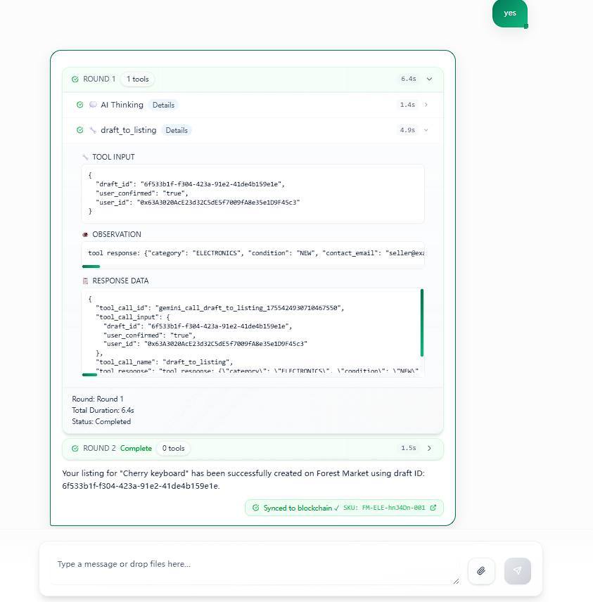

# AI-Powered Multi-Agent E-commerce Ecosystem

🏆 **ETH Global NYC 2025** - Competing for "Best Use of Actions & Agents on Flow" Prize

**Built on Flow EVM Testnet** - Transparent AI Agent Behavior Tracking

DaVinci is an AI-powered multi-agent e-commerce ecosystem that empowers anyone to build a global, automated, and continuously evolving online business. Run your store 24/7 with full automation and generate profits effortlessly.

## 🌊 Flow EVM Integration

**Contract Address**: [`0xd2F523a0085781Aa8492eeA6E84F0152B2c26E8f`](https://evm-testnet.flowscan.io/address/0xd2F523a0085781Aa8492eeA6E84F0152B2c26E8f) (Flow EVM Testnet)

DaVinci leverages **Flow EVM Testnet** to create transparent, immutable records of AI agent actions and stock behavior:

### 🤖 AI Agent Actions on Flow
- **Product Listings**: Every AI-generated product listing recorded on-chain with unique SKUs
- **Inventory Tracking**: Real-time stock updates and availability synchronized to Flow EVM
- **Decision Audit Trail**: Complete history of AI agent decisions for transparency
- **Price Updates**: Dynamic pricing changes tracked on-chain for verification
- **Customer Trust**: Verifiable AI behavior builds confidence in autonomous operations

### 📊 Live Demo
The system successfully demonstrates AI agent behavior tracking:
- ✅ **Cherry keyboard** listing created with SKU `FM-ELE-3m3dm-001`
- ✅ **Real-time sync** to Flow EVM Testnet blockchain
- ✅ **Transparent operations** viewable on [Flow EVM Testnet Explorer](https://evm-testnet.flowscan.io/address/0xd2F523a0085781Aa8492eeA6E84F0152B2c26E8f)
- ✅ **Agent decisions** recorded with full audit trail

Here is the Snapshot: 

### 🔗 Technical Implementation
- **Smart Contract**: Custom listing sync contract deployed on Flow EVM Testnet
- **Real-time Sync**: Instant blockchain updates when AI agents create listings
- **SKU Generation**: Unique identifiers (Format: `FM-CAT-EID123-001`) for each product
- **Event Logging**: On-chain events for every agent action and decision
- **Multi-Agent System**: Specialized AI agents with transparent decision tracking

---

## 🏆 ETH Global NYC 2025 Submission

**Prize Category**: Best Use of Actions & Agents on Flow

**Project Requirements Met**:
- ✅ **Deployed Smart Contract**: `0xd2F523a0085781Aa8492eeA6E84F0152B2c26E8f` on Flow EVM Testnet
- ✅ **Agent Actions**: AI agents autonomously create product listings and sync to blockchain
- ✅ **Transparent Behavior**: Every agent decision recorded on-chain for verification
- ✅ **Real-world Application**: Solves trust issues in AI-powered e-commerce at scale

**Innovation**: DaVinci bridges AI automation with blockchain transparency, creating the first verifiable AI commerce platform where every agent action is immutably recorded on Flow EVM.

**Live Proof**: View our contract and transactions on [Flow EVM Testnet Explorer](https://evm-testnet.flowscan.io/address/0xd2F523a0085781Aa8492eeA6E84F0152B2c26E8f)

---

## Vision: AI as Your Business Co-founder

DaVinci transforms AI into your intelligent co-founder—automating decisions, operations, and growth. You focus on creativity and products; AI handles sourcing, pricing, fulfillment, marketing, and customer service.

---

## Key Benefits

- Borderless Commerce: Supports crypto payments (e.g., USDT, USDC, and more)
- Continuous Learning: Every transaction enhances AI's operational intelligence
- Zero Team Required: Fully automated AI-powered operations
- Global Reach: Integrated with ForestMarket.net for worldwide accessibility

---

## Core AI Modules

### Multi-Agent System
Specialized AI agents cover the full spectrum of operations:
- Product selection and curation
- Dynamic pricing strategies
- Risk assessment and control
- Automated customer support
- Marketing campaign management

### AI-Powered Product Sourcing
- Real-time trend analysis
- User preference prediction
- Competitor monitoring and analysis
- Market opportunity identification

### Smart Inventory & Logistics
- Automated API integrations
- Intelligent restocking systems
- Optimized delivery routing
- Supply chain management

### AI Marketing Engine
- Automated content generation
- Advanced user segmentation
- Multi-language campaign creation
- Performance optimization

### Risk & Compliance Automation
- Dynamic pricing safeguards
- Automated customs/tax rule lookups
- Payment compliance monitoring
- Fraud detection and prevention

### Crypto Payment Integration
- MetaMask and OKX wallet support
- Real-time settlement
- No banking barriers
- Multi-cryptocurrency support

---

## How DaVinci Evolves

DaVinci continuously improves itself through machine learning:
- Transaction-driven learning: every sale, cost, and customer interaction becomes training data for the AI agents to evolve.
- Real-Time Optimization: Dynamic pricing and trend forecasting
- Performance Enhancement: Ad performance and customer retention optimization
- Predictive Analytics: Customer profiling and behavioral prediction

DaVinci is an AI commerce system that learns, earns, and evolves alongside your business.

---

## Tech Stack

- Frontend: Next.js 15, React 19, TypeScript
- Styling: Tailwind CSS, Radix UI Components
- Content Management: BaseHub CMS
- Email Service: Resend API
- Authentication: Next-themes for theme management
- Deployment: Vercel
- DIFy / OpenAI platform integration
- Kimi platform for AI assistant and automation tasks
- Telegram bot
- Web3: Flow EVM

---

## License

This project is licensed under the MIT License. See the LICENSE file for more details.

---

Built with by the DaVinci AI Team
Empowering the future of autonomous e-commerce through artificial intelligence
